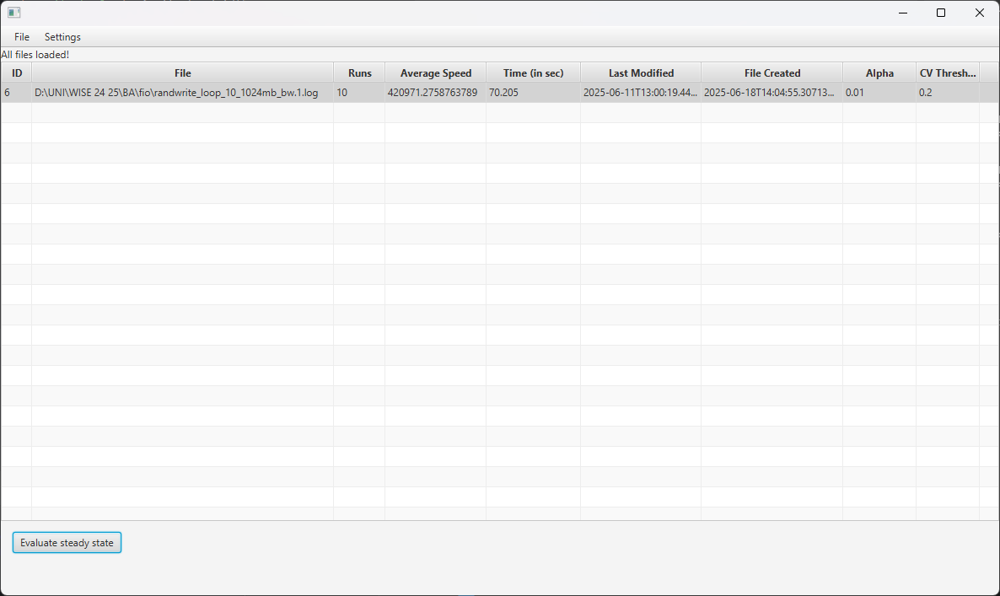
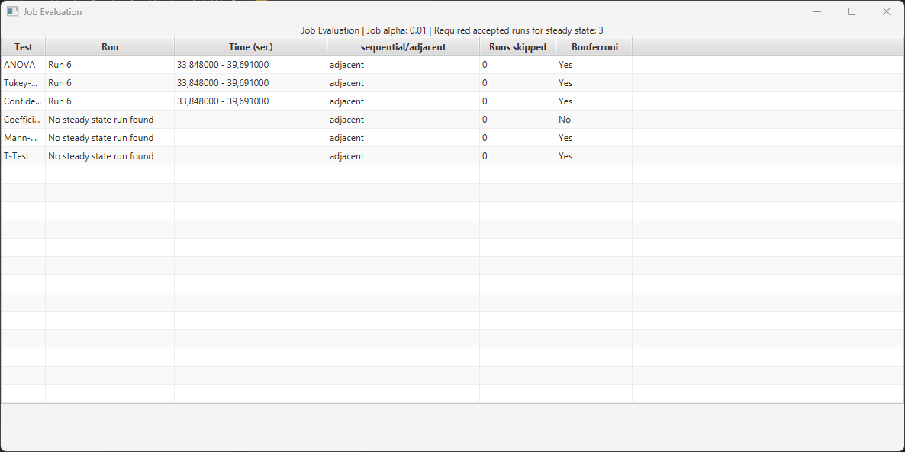

# Beispiel und Beschreibung der Log `randwrite_loop_10_1024mb_bw.1`

## Übersicht

Die Datei `randwrite_loop_10_1024mb_bw.1` ist das Ergebnis eines Tests mit dem `fio` (Flexible I/O Tester)-Tool, entwickelt von Jens Axboe. Sie dokumentiert die Bandbreitenmessung eines zufälligen Schreibtests (random write) auf einer `fio` definierten Datenmenge.

## Testkonfiguration

### Parameterbeschreibung
Die Testkonfiguration wurde mit den folgenden Parametern ausgeführt:

- **Testart**: Zufälliges Schreiben (random write)
- **Schleifenanzahl (loop)**: 10 Wiederholungen
- **Datenmenge**: 1024 MB pro Schleife
- **Ergebnis**: Bandbreitenstatistik

### Beispiel `fio`-Befehl
Der Test wurde mit diesem Befehl durchgeführt:

```bash
fio --name=randwrite_test --rw=randwrite --size=1024m --loops=10 --write_bw_log=randwrite_loop_10_1024mb
```

### Parametererläuterungen

- `--name`: Name des Jobs, hier "randwrite_test".
- `--rw=randwrite`: Zufälliges Schreiben.
- `--size=1024m`: Datenmenge von 1024 MB.
- `--loops=10`: Test wird 10 Mal wiederholt.
- `--write_bw_log`: (write bandwidth log) Ausgabe des Jobverlaufs als Log mit Bandbreitengeschwindigkeit.

## Inhalt der Datei (`--write_bw_log`)

Die Datei enthält detaillierte Informationen über die Bandbreite und andere Leistungskennzahlen für jeden Durchgang des Tests.

### Aufbau der Zeilen des Logs:

`Time, Bandwidth, data direction, Blocksize, Offset`

## Auswahl des Logs mit ATool



- Mit **Evaluate steady state** werden alle Tests durchgeführt und in einer Tabelle vorgestellt

## Evaluierung des Jobs mittels ATool
- Evaluierung des `randwrite_loop_10_1024mb_bw.1.log`
- Die Konfiguration sind mit dargestellt


