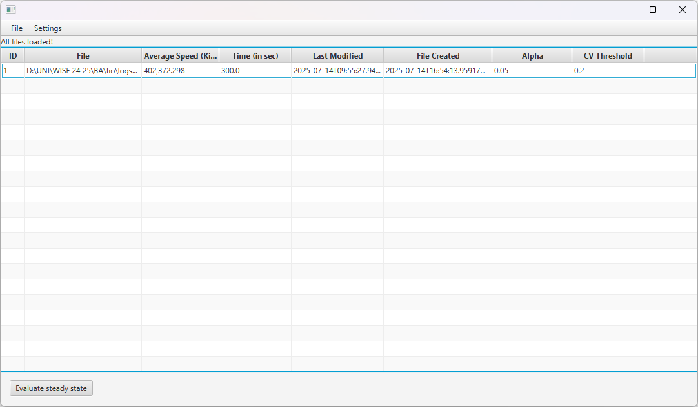
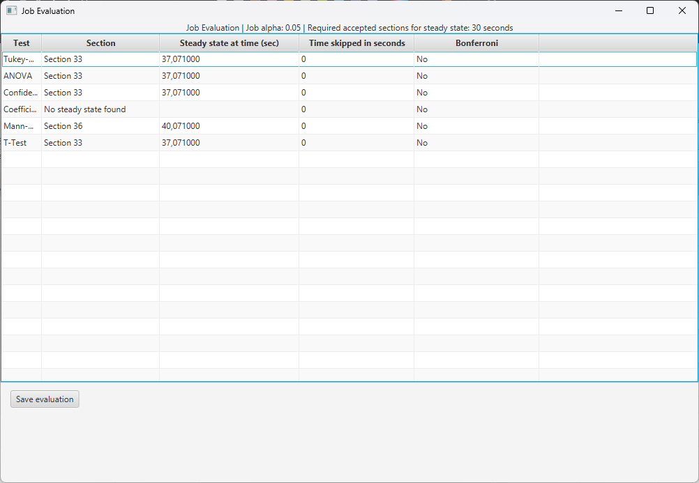

# Beispiel und Beschreibung der Log `mytest_300s_bw.1.log`

## Übersicht

Die Datei `mytest_300s_bw.1.log` ist das Ergebnis eines Tests mit dem `fio` (Flexible I/O Tester)-Tool, entwickelt von Jens Axboe. Sie dokumentiert die Bandbreitenmessung eines zufälligen Schreibtests (random write) auf einer `fio` definierten Datenmenge.

## Testkonfiguration

### Parameterbeschreibung
Die Testkonfiguration wurde mit den folgenden Parametern ausgeführt:

- **Testart**: Lesen (read)
- **Schleifenanzahl (loop)**: 1000 Wiederholungen
- **Maximale Laufzeit**: 300 Sekunden
- **Datenmenge**: 1024 MB pro Schleife

### Beispiel `fio`-Befehl
Der Test wurde mit diesem Befehl durchgeführt:

```bash
fio --rw=read --write_bw_log=mytest_300s --name=test --runtime=300 --size=1g --loop=1000
```

### Parametererläuterungen

- `--rw=read`: read
- `--write_bw_log`: "mytest_300s"
- `--name`: test
- `--runtime`: 300 Sekunden
- `--size=1024m`: Datenmenge von 1024 MB.
- `--loops=1000`: Test wird 1000 Mal wiederholt.

Das Programm bricht nach 300 Sekunden unabhängig von der Loop Anzahl.

## Inhalt der Datei (`--write_bw_log`)

Die Datei enthält detaillierte Informationen über die Bandbreite und andere Leistungskennzahlen für jeden Durchgang des Tests.

### Aufbau der Zeilen des Logs:

`Time, Bandwidth, data direction, Blocksize, Offset`

## Auswahl des Logs mit ATool



- Mit **Evaluate steady state** werden alle Tests durchgeführt und in einer Tabelle vorgestellt

## Evaluierung des Jobs mittels ATool
- Evaluierung des `randwrite_loop_10_1024mb_bw.1.log`
- Die Konfiguration sind mit dargestellt


