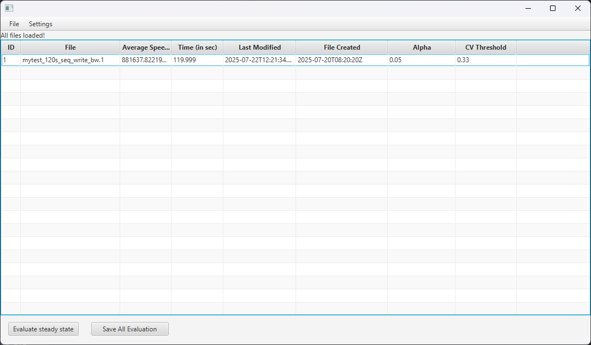
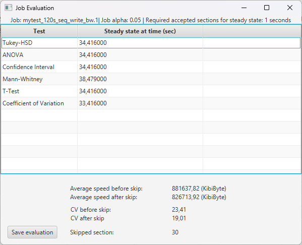

# Beispiel und Beschreibung der Log `mytest_120s_seq_write_bw.1.log`

## Übersicht

Die Datei `mytest_120s_seq_write_bw.1.log` ist das Ergebnis eines Tests mit dem `fio` (Flexible I/O Tester)-Tool, entwickelt von Jens Axboe. Sie dokumentiert die Bandbreitenmessung eines seq. write auf einer `fio` definierten Zeitlänge.

## Testkonfiguration

### Parameterbeschreibung
Die Testkonfiguration wurde mit den folgenden Parametern ausgeführt:

- **Testart**: Schreiben (write)
- **Schleifenanzahl (loop)**: 100 Wiederholungen
- **Maximale Laufzeit**: 120 Sekunden
- **Datenmenge**: 10 GB pro Schleife

### Beispiel `fio`-Befehl
Der Test wurde mit diesem Befehl durchgeführt:

```bash
fio fio --rw=write --write_bw_log=mytest_120s_seq_write_bw --name=test --runtime=120 --size=10g --loop=100
```

### Parametererläuterungen

- `--rw=write`: write
- `--write_bw_log`: "mytest_120s_seq_write_bw"
- `--name`: test
- `--runtime`: 120 Sekunden
- `--size=1024m`: Datenmenge von 10 GB.
- `--loops=1000`: Test wird 100 Mal wiederholt.

Das Programm bricht nach 120 Sekunden unabhängig von der Loop Anzahl ab.

## Inhalt der Datei (`--write_bw_log`)

Die Datei enthält detaillierte Informationen über die Bandbreite und andere Leistungskennzahlen für jeden Durchgang des Tests.

### Aufbau der Zeilen des Logs:

`Time, Bandwidth, data direction, Blocksize, Offset`

## Auswahl des Logs mit ATool



- Mit **Evaluate steady state** werden alle Tests durchgeführt und in einer Tabelle vorgestellt

## Evaluierung des Jobs mittels ATool
- Evaluierung des `mytest_120s_seq_write_bw.1.log`
- Die Konfiguration sind mit dargestellt


